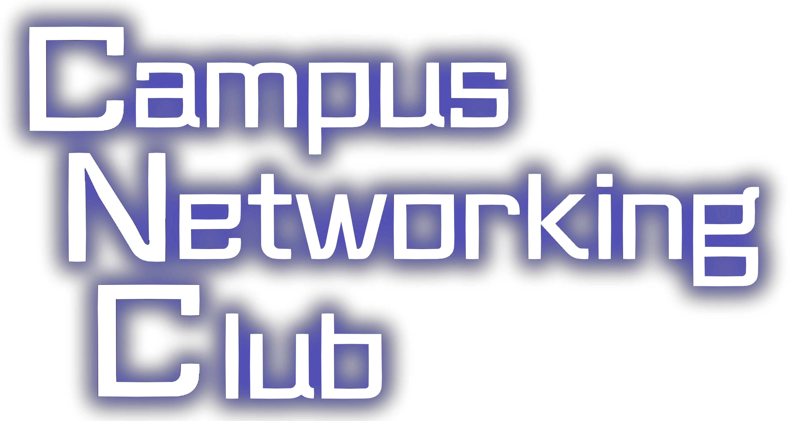
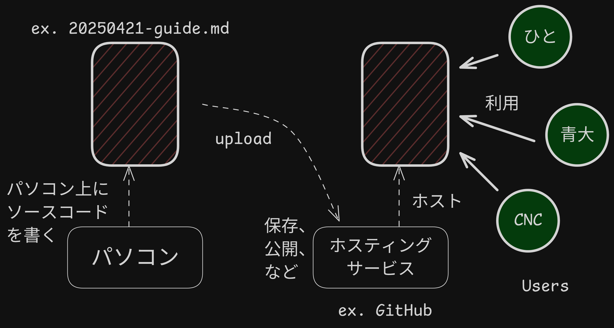

# 1st CNC Study Group, 2025 | 2025年度第一回CNC勉強会

Writer: Joshua Liew  
| 作成者：ジョシュア  
Date: 2025/4/21 (Monday)  
| 日時：2025/4/21（月曜日）  
Place: Aomori University, Aomori Campus, Laboratory 5406  
| 場所：青森大学 青森キャンパス 5406研究室


### 本日のプログラム

本日の勉強会の流れが以下のようになります。

1. アイスブレイク・自己紹介ゲーム
2. CNCについて
3. LINUX勉強会
    - GitHubについて
    - GitHubのアカウント作成
    - Boot.devの"Learn Linux"コースへ登録
    - WSL2 & Ubuntuのインストール
    - "Learn Linux"コース 第一章完了
4. 17th APNG Campの振り返り
5. 本日のチャレンジ問題・課題


---


## アイスブレイク・自己紹介ゲーム (10 min)

アイスブレイクとは？ [by Slack](https://slack.com/intl/ja-jp/blog/collaboration/what-is-benefit-and-purpose-of-icebreaker)
> アイスブレイクとは、本題に入る前に行われる短い雑談やゲームのことを指します。
特に、初対面の相手と話す際には、お互いに相手がどのような人物かわからないため、雰囲気が堅くなりがちです。
堅く張り詰めた空気を氷に例え、氷を崩すように緊張をほぐすことからアイスブレイクと呼ばれています。

本日はとてもシンプルなアイスブレイク・自己紹介ゲームを行います。
- 初めに、それぞれの __名前__ と __学部__ を言ってください。（一周）
    > 例．名前はジョシュアです。学部はソフトウェア情報学部です。よろしくお願いします。
1. __好きな食べ物__ を紹介してください！
    - 机の上に付箋・ノートがあります。一枚とって __好きな食べ物__ を記入してください。
    - 書き終わったら、その一枚をボウルに入れてください。（全員）
    - それぞれの __名前__ と付箋・ノートに書いた __好きな食べ物__ を言ってください。（一周）
2. ボウルから一枚とって、書かれた __好きな食べ物__ から仲間の名前を当ててみてください。（一周）

3. __趣味__ を紹介してください！
    - 机の上に付箋・ノートがあります。一枚とって __趣味__ を記入してください。
    - 書き終わったら、その一枚をボウルに入れてください。（全員）
    - それぞれの __名前__ と付箋・ノートに書いた __趣味__ を言ってください。（一周）
4. ボウルから一枚とって、書かれた __趣味__ から仲間の名前を当ててみてください。（一周）


## CNC (Campus Networking Club) について (5 min)


CNCは、学内ネットワークをより良くすることを目指しているクラブ・サークルです。  
私たちのバリュー・大事にしていることは：
- Play = 失敗から学ぶこと。| CNCは、失敗しても良い場所です。
- Passion = 情熱をもって学ぶこと。| CNCは、様々な技術に触れる場所です。
- People = 仲間と共に学ぶこと。| CNCは、学内の唯一のITコミュニティです。  

CNCは、学内ネットワークをより良くするために、そのビジョンに貢献する活動に取り組んでいます。
- Linux勉強会、その他の勉強会
    - 目的：学生の、学生による、学生のための __IT人材育成__ に務めることです。
- ネットワーク構築プロジェクト
    - 目的：青森大学のネットワーク環境の整備を通して、 __実践的な学び__ を提供することです。
- eduroam in 青森大学の開発・運用・保守
    - 目的： __青大生__ としてだれでもがどこに居ても使えるインターネットを提供することです。


## LINUX勉強会（第１回）

勉強会のスタイルとしては、なるべくハンズオンでインタラクティブです。  
> __留意点__：基礎の基礎からやりますので、退屈に感じる方は仲間のサポートに入ったり温かく見守ったりしていただけたらと思います！


#### GitHubのアカウント作成 (10 min)

GitHubは？<https://github.co.jp/>
> GitHubは、ユーザのみなさんからヒントを得て作成された開発プラットフォームです。
オープンソースプロジェクトやビジネスユースまで、GitHub上に __ソースコード__ を __ホスティング__ することで
数百万人もの他の開発者と一緒にコードのレビューを行ったり、プロジェクトの管理をしながら、
ソフトウェアの開発を行うことができます。

- "ソースコード" について：<https://trends.codecamp.jp/blogs/media/terminology154>
- "ホスティング" について：<https://biz.kddi.com/content/glossary/h/hosting/#:~:text=Hosting>


GitHubアカウントの作成：<https://docs.github.com/ja/get-started/start-your-journey/creating-an-account-on-github>
参考資料1：<https://qiita.com/ayatokura/items/9eabb7ae20752e6dc79d>  
参考資料2：<https://zenn.dev/protoout/articles/50-howto-github-setup>  
参考資料3：<https://zenn.dev/keison8864/articles/069d9be35b92c2>  
> 補足：GitHubアカウントの作成にあたって、個人メールの利用を推奨します。


#### Boot.devの"Learn Linux"コースへ登録 (5 min)

[Boot.dev](https://www.boot.dev/) は？  
Lane Wagner氏により開発されたバックエンドエンジニア学習プラットフォームです。

["Learn Linux"](https://www.boot.dev/courses/learn-linux)コースについて：  
- 多くの開発者は、シェルやターミナル、Linux（あるいはUnix系のシステム）の基本を理解しない
まま何年間も過ごしてしまいます。このコースでは、ファイルやディレクトリの操作方法、
依存関係のインストール、PATHの設定、そして `grep` や `find`、パイプなどの強力なCLIツールの使い方を学びます。
もうコマンドラインを恐れる必要はありません。(ChatGPTより)
> 原文：So many developers go years before understanding the basics of shells, terminals, and Linux 
(or more generally Unix-like systems). Here you'll learn to navigate files and directories, install dependencies, 
configure your PATH, and use powerful CLI tools like grep, find, and pipes. 
Never fear the command line again, make it fear you.
- このコースには、Google、HashiCorp、Stripe、Microsoft などの企業から 39,711 人の受講者が参加しています。(ChatGPTより)
> 原文：39,711 learners from companies like Google, HashiCorp, Stripe, Microsoft

登録方法：  
1. "Sign In And Start Course" をクリックしてください。（コースにサインインする）
2. "Sign In With GitHub" を選択してください。（GitHubでサインインする）
    - 初サインインの場合、GitHubの承認が必要になります。"Authenticate" を選択してください。
3. "CH1: Terminals and Shells" の "L1: Welcome to Learn Linux" を選択してください。

---


### CH1: Terminals and Shells | ターミナルとシェルについて

---

#### L1: Welcome to Learn Linux (ChatGPTより翻訳)

##### Welcome to Learn Linux | Learn Linux へようこそ
「Learn Linux」へようこそ！正直に言うと、このコース名は少し誤解を招くかもしれません。
「Linux」と名付けたのは、多くの受講者がこのコースで扱う概念を「Linux」として認識しているからです。
より正確なタイトルは「Unix系環境でのシェルとターミナルの使い方を学ぶ」かもしれませんが、それではちょっと長すぎますよね。

##### Learning Goals | 学習目標
- シェルとターミナルの違いを理解する
- コマンドラインを使ってファイルシステムを操作・移動する方法を学ぶ
- コマンドラインを使ってソフトウェアをインストールする方法を学ぶ
- PATHや環境変数の管理方法を理解する
- パーミッション（権限）の管理方法と、プログラムの実行方法を学ぶ

このコースでは、コマンドラインの操作に慣れてもらいます。コマンドラインは、
今後エンジニアとして活躍する上で非常に重要なスキルです。
そのため、このコースではブラウザ上でコードを書くのではなく、
__*自分のマシン上*__ で直接コマンドラインインターフェース（CLI）を使って作業していきます。

##### Assignment | 演習課題
1. 自分のパソコンで、ターミナルを起動してみてください。
    - Macユーザ向け：<https://support.apple.com/ja-jp/guide/terminal/apd5265185d-f365-44cb-8b09-71a064a42125/mac>
    - Windowsユーザ向け：「Windowsターミナル」のインストールを推奨
        - <https://learn.microsoft.com/ja-jp/windows/terminal/install>
        - <https://learn.microsoft.com/ja-jp/windows/terminal/customize-settings/startup>
2. 次のコマンドを打って、enterキーで実行してみてください。
```
echo "Hello World"
```
3. 実行結果を確認したら、次の設問に答えてください。

##### 設問：What happened when you pressed 'enter'?
- [ ] 「Hello World」というテキストがターミナルのコンソールに出力されました。
- [ ] エラー・メッセージが出力されました。
- [ ] 何も起こりませんでした。

---

#### L2: Command Line vs. GUI (ChatGPTより翻訳)
