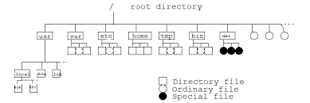

# 3rd CNC Study Group, 2025 | 2025年度第三回CNC勉強会

Writer: Joshua Liew  
| 作成者：ジョシュア  
Date: 2025/5/26 (Monday)  
| 日時：2025/5/26（月曜日）  
Place: Aomori University, Aomori Campus, Laboratory 5406  
| 場所：青森大学 青森キャンパス 5406研究室


### 本日のプログラム

本日の勉強会の流れが以下のようになります。

1. [LINUX勉強会（前半）](#learn-linux)
    - CH2: Filesystems (Boot.dev)
        - [L1: What is a Filesystem?](#what-is-a-filesystem)
        - [L2: Filepaths](#filepaths)
        - [L3: Parent Directories](#parent-directories)
        - [L4: Absolute vs. Relative Paths](#absolute-vs-relative-paths)
        - [L5: Absolute vs. Relative Paths (Part 2)](#absolute-vs-relative-paths-part-2)
2. [チャレンジ問題１](#challenge)
    - 休憩
3. LINUX勉強会（後半）
    - CH2: Filesystems (Boot.dev)
        - [L6: Files](#files)
        - [L7: head and tail](#head-and-tail)
        - [L8: More and Less](#more-and-less)
        - [L9: Touch](#touch)


---


## Learn Linux
### 1. LINUX勉強会（第３回）前半


#### CH2: Filesystems, Lesson 1
#### What is a Filesystem?


__「ファイルシステム」とは？__  
コンピュータ上に保存されているすべてのデータは、
「ファイル」と「ディレクトリ」に整理されています。
これらのファイルとディレクトリは、
ファイルシステムと呼ばれる木構造（ツリー構造）で管理されています。

- __ディレクトリ__ （Windowsでは「フォルダ」とも呼ばれます）は、
__ファイルや他のディレクトリをまとめて格納する「入れ物」です。__
- __ファイル__ は、 __単なる生のバイナリデータ（0と1）の集合体です。__
ファイル内のバイト列は、テキスト、画像、動画など、あらゆるデータを表すことができます。

  
出典：<http://uralowl.my.coocan.jp/unix/job/UNIX/kernel/file.html>

ファイルシステムのツリー構造は、
__ルートディレクトリ `/`__ と呼ばれる一つのディレクトリから始まります。
ルートディレクトリの中にはファイルやディレクトリがあり、
さらにその中に別のファイルやディレクトリがある...
といった具合に階層的に構成されています。

ターミナルを開いたとき、作業ディレクトリ *（現在自分が「いる」ディレクトリ）*
は、システムや設定によりますが、多くの場合は自分の
__ホームディレクトリ（例：/home/ユーザー名）__ になっています。


##### Assignment（演習課題）
LINUX系のマシンにログインしたとしましょう。
まず、自分の「いる」ディレクトリがどこにあるのか知りたいのです。

- [ ] 「現在の作業ディレクトリ（カレントディレクトリ）」
の[パス](https://wa3.i-3-i.info/word18264.html)を確認するには、
次のコマンドを実行します：  
```
pwd
```
> このコマンドは「print working directory（作業ディレクトリを表示）」の略で、
今あなたがいるディレクトリのフルパスを表示してくれます。
- [ ] コマンドを実行したら、 __表示された出力結果（パス）__ 
をコピーして、テキスト欄に貼り付けて提出してください。

---

#### CH2: Filesystems, Lesson 2
#### Filepaths


__ファイルパスとは？__  
`pwd` コマンドの出力は __ファイルパス（filepath）__ と呼ばれます。
__ファイルパスとは、コンピュータ内のファイルやディレクトリの場所を表す文字列のことです。__
あなたの出力は、たとえば以下のようになっているはずです：
```
/Users/wagslane
```
実際のテキスト（ユーザー名など）は異なるかもしれませんが、構造は基本的に同じです。
それでは、このファイルパスの構造を分解して見てみましょう：
- 最初のスラッシュ `/` は、 __ルートディレクトリ__ を表しています。
これは、ファイルシステムツリーの最上位（根っこ）にあたる場所です。
- 次の部分 `Users` は、ルートディレクトリの中にある __ディレクトリの名前__ です。
- 最後の部分 `wagslane` は、Users ディレクトリの中にある別のディレクトリです。
つまりこのパスは、「ルートから2階層下のディレクトリ」を指していることになります。

以下のようなツリー構造で表すこともできます：
```
/
└── Users
    └── wagslane
```
> ボーナス問題：  
自分の端末の `pwd` で出力したファイルパスをツリー構造で書いてみましょう。


##### Assignment（演習課題）
- [ ] 以下のコマンドを __一つずつ__ コピーして、ターミナルに貼り付けて実行してください。  
これらのコマンドは、今後のレッスンで使用する `worldbanc` ディレクトリを GitHub
からダウンロードし、準備するためのものです。
>※ パスワードを求められた場合は、
Ubuntu（WSL）のセットアップ時に設定したユーザーのパスワードを入力してください。
```
curl -L https://github.com/bootdotdev/worldbanc/archive/refs/heads/main.zip -o worldbanc.zip
unzip worldbanc.zip
rm worldbanc.zip
mv worldbanc-main worldbanc
sudo chown -R $(whoami) worldbanc
sudo chmod -R 755 worldbanc
```

> これらのコマンドが何をしているかは、後ほどのレッスンで詳しく説明します。

>>コマンドの実行が成功すると、
現在の作業ディレクトリに `worldbanc` というディレクトリが作成されているはずです。

>>もし作業中に `worldbanc` ディレクトリの中身を壊してしまっても、
このレッスンに戻って再度ダウンロードすれば大丈夫です。

- [ ] 次のコマンド「list（一覧表示）」で、
現在の作業ディレクトリにあるファイルやディレクトリの一覧が表示されます。
    ```
    ls
    ```
    `worldbanc` ディレクトリがリストの中にあるはずです。

- [ ] 「change directory（ディレクトリを移動する）」コマンドで、
`worldbanc` ディレクトリの中に移動しましょう。
    ```
    cd worldbanc
    ```

- [ ] `ls` コマンドを用いて `worldbanc` ディレクトリの中身を確認してください。
出力結果（ファイルやディレクトリの一覧）をコピーして、
テキスト欄に貼り付けて提出してください。
> アドバイス：  
`cd` を実行した後に必ず `ls` を実行する習慣を身につけること


##### Troubleshooting（デバッグ）
`curl` や `unzip` がない場合：  
Ubuntu や WSL に `curl` や `unzip` がインストールされていない場合は、
以下のコマンドを使ってインストールしてください：
```
sudo apt install unzip
sudo apt install curl
```

> 補足：  
> これらの操作は Linux や WSL の基本操作を学ぶ上でとても重要です。
コマンドの意味は後ほどの回で丁寧に解説されますので、今は気にせず実行してみましょう。

---

#### CH2: Filesystems, Lesson 3
#### Parent Directories


__親ディレクトリ（Parent Directory）__ について：  
`cd` コマンドは「ディレクトリを移動する」ためのコマンドです。
たとえば `cd worldbanc` とすると、`worldbanc` ディレクトリの中に移動できます。

では、 __現在のディレクトリから「ひとつ上の階層」に戻りたいとき__
はどうすればいいでしょうか？

答えは `..`（ドット2つ） です。

`..` は、「親ディレクトリ」 を表す特別なエイリアス（ショートカット）です。
これを使うことで、ディレクトリツリーをひとつ上に戻ることができます。


##### Assignment（演習課題）
- [ ] まず、`worldbanc` ディレクトリの「親ディレクトリ」に戻ります。
`worldbanc` ディレクトリの一番上（トップレベル）にいる場合は、
以下のコマンドを実行してください：
```
cd ..
```
> `cd ..` は「親ディレクトリに移動する」という意味です。  
> 図でイメージすると、以下のようになります：  
>```
>/home/user/worldbanc ← 現在地
>        ↓
>       cd ..
>        ↓
>/home/user ← 一つ上の階層へ
>```
> このようにして、ディレクトリ階層を自由に行き来できるようになります。

- [ ] 次に、親ディレクトリから `worldbanc` の中身を確認します。
`ls` コマンドに `worldbanc` を引数（ひきすう）として渡すことで、
その中の内容を表示できます：
```
ls worldbanc
```

- [ ] 表示された出力結果（ファイルやディレクトリの一覧）をコピーして、
テキスト欄に貼り付けて提出してください。

> この手順は、
他のディレクトリの中身を自分がその中に入らずに確認する方法としても便利です。

---

#### CH2: Filesystems, Lesson 4
#### Absolute vs Relative Paths


##### 相対パス（relative paths）について：
これまでの操作では主に「相対パス」を使ってきました。
相対パスとは、「現在のディレクトリ（作業ディレクトリ）
を基準にして目的のファイルやディレクトリの場所を示す方法」です。

たとえば、次のようなディレクトリ構造があるとします：
```
vehicles
├── cars
│   ├── fords
│   │   ├── mustang.txt
│   │   └── focus.txt
```

__ケース①：作業（現在）ディレクトリが `vehicles` ディレクトリの場合__  
`mustang.txt` への相対パスは次のようになります：
```
cars/fords/mustang.txt
```

__ケース②：作業ディレクトリが `cars` ディレクトリの場合__  
相対パスはもう少し短くなります：
```
fords/mustang.txt
```

__ケース③：作業ディレクトリが `fords` ディレクトリの場合__  
このときは、ファイル名だけでOKです：
```
mustang.txt
```


##### 絶対パス（absolute paths）について：  
__絶対パス__ とは、
「ファイルシステムのルート（最上位）からの完全な経路」を表すパスのことです。
Unix系のシステム（Linux や macOS）では、
ルートディレクトリはスラッシュ `/` で表されます。
```
/vehicles/cars/fords/mustang.txt
```
このパスは、*今どこにいるかに関係なく*、常にこのファイルを正確に指し示します。

たとえば、次のようなディレクトリ構造があり、`fords` ディレクトリの中にいるとします。
```
vehicles
├── cars
│   ├── fords
│   │   ├── mustang.txt
│   │   └── focus.txt
```
次の2つの書き方は同じファイルを指します：
- 絶対パスを使った書き方：
```
/vehicles/cars/fords/mustang.txt
```
- 相対パスを使った書き方：
```
mustang.txt
```

> ChatGPTによる補足：  
このように、__絶対パスは常に変わらない経路を示し、
相対パスは「現在地」からの距離を表す経路になります。__
場面に応じて使い分けることが、Linux操作の基本スキルのひとつです。


##### どちらを使うべき？使い分けについて：
それは状況によります。

相対パスは読み書きが簡単で、
正しいディレクトリ（または想定しているディレクトリ）にいる限り、理解しやすいです。

絶対パスはより明確です。
自分が現在どのディレクトリにいるのか分からない場合に便利です。
たとえば、誰かにコンピュータ上のファイルの見つけ方を説明しているとします。
相手が説明をするときにどのディレクトリにいるか分からないので、
絶対パスを使う必要があります。


##### 設問：Which is a relative path?
この中から、相対パスのものを選択してください
- [ ] `home/ryan`
- [ ] `/usr/bin/ls`
- [ ] `/home/ryan`
- [ ] `/bin/ls`

---

#### CH2: Filesystems, Lesson 5
#### Absolute vs Relative Paths: Part 2


> このレッスンでは、解説はありません。次の設問に答えてください。
##### 設問：Which of the following paths always points to the same file, no matter the current working directory?
次のパスの中から、
作業ディレクトリに関係なく、同じファイルを常に指定するものを選択してください。
- [ ] ryan/passwords/secret.txt
- [ ] ryan
- [ ] bin/ls
- [ ] /usr/bin/ls


---


### Challenge
### 2. チャレンジ問題１

__前提：__  
`worldbanc` ディレクトリを既にダウンロードしていること
> その手順は [CH2L2: Filepaths](#filepaths) に書いてあります。

__チャレンジ問題：__  
`cd`, `ls`, `pwd` のコマンドで得られた出力結果のみをもとに
`worldbanc` ディレクトリの中身全てをツリー構造で紙に書いてください。


---


### 3. LINUX勉強会（第３回）後半


#### CH2: Filesystems, Lesson 6
#### Files


__ファイル__ について：  
Windows Explorer や Finder などの GUI を使っていると、
「ファイル」という概念にはすでに馴染みがあると思います。

本質的には、ファイルは __ただのデータのかたまり（バイナリの塊）__ です。
ファイル内の生のバイト列（0 と 1）は、テキスト、画像、動画など、何でも表現できます。

__`cat` コマンド__ について：  
`cat` コマンドは、ファイルの中身を表示するために使われます。
`cat` は「concatenate（連結する）」の略で、「つなげる」という意味です。

1つのファイルを表示するときには少し不思議な名前に感じるかもしれませんが、
複数のファイルを一度に表示・連結するときには、その意味がしっくりきます。

```
# ファイルの内容をターミナルに表示する
cat file1.txt
```

```
# 複数のファイルの内容を連結してターミナルに表示する
cat file1.txt file2.txt
```


##### Assignment（演習課題）
- [ ] `cd` コマンドを使って、
まだ `worldbanc` ディレクトリにいない場合はその中へ移動してください。
- [ ] `ls` コマンドを使って、正しい場所にいるか確認しましょう。
`public` というディレクトリが表示されるはずです。
- [ ] `public` ディレクトリに `cd` で移動してください。
- [ ] `pr_ideas.txt` という名前のファイルが表示されるはずです。
- [ ] `cat` コマンドを使って、その内容を表示してください。

その __出力結果すべて__ をコピーして、指示されたテキスト欄に貼り付けて提出してください。

---

#### CH2: Filesystems, Lesson 7
#### head and tail


ファイルが非常に大きい場合、すべての内容を表示したくないこともあります。

__`head` コマンド：__  
`head` コマンドは、ファイルの __先頭から指定した行数 `-n [num]`__ を表示します。
```
head -n 10 file1.txt
```
この例では、`file1.txt` の最初の 10 行を表示します。
行数 `-n` を指定しない場合、デフォルトで先頭の 10 行が表示されます。

__`tail` コマンド：__  
`tail` コマンドは、ファイルの __末尾から指定した行数 `-n [num]`__ を表示します。
```
tail -n 10 file1.txt
```


##### Assignment（演習課題）
- [ ] `cd` コマンドを使って、
`worldbanc/private/transactions/` ディレクトリに移動してください。
- [ ] `cat` コマンドを使って、`2023.csv` ファイルの内容を確認します。
このファイルは非常に長いことに気付くはずです。全てを表示するのは避けたいです。
- [ ] `head` コマンドを使って、`2023.csv` の __最初の6行__ を表示し、
それをコピーしてテキスト欄に貼り付けてください。ただし、まだ提出しないでください。

> ※ 最初の行はヘッダーなので、
それに加えて最初の5件のトランザクションを含めるため、6行を表示します。

- [ ] `tail` コマンドを使って、`2023.csv` の __最後の5行__ を表示し、
それもコピーしてテキスト欄に貼り付けてください。

合計で11行（最初の6行＋最後の5行）をテキスト欄に貼り付けて提出してください。

---

#### CH2: Filesystems, Lesson 8
#### More and Less


[`more`](https://www.ibm.com/docs/en/aix/7.3.0?topic=m-more-command)
と [`less`](https://man7.org/linux/man-pages/man1/less.1.html) コマンドは、
ファイルの内容を __1ページ（または1行）ずつ__ 表示するためのコマンドです。

ことわざにもあるように、「less（より少なく）is more（より多く）」。
`less` コマンドは `more` コマンドと同じことができ、さらに多くの機能を持っています。

一般的には、`more` よりも `less` を使うべきです。
`more` を使うのは、そのシステムに `less` がインストールされていない場合だけです。


##### Assignment（演習課題）
- [ ] `less` コマンドを実行し、`worldbanc/private/transactions` ディレクトリにある
`2023.csv` ファイルへのパスを渡してください。
```
less 2023.csv
```
> この時点で対話モードに入り、シェルプロンプトが表示されなくなります。
これは `less` がターミナル画面を制御しているためです。

- [ ] 数回 `Enter` キーを押して数行下にスクロールしてみてください。
`q` を押すと `less` を終了してシェルプロンプトに戻れます。

- [ ] もう一度 `less` コマンドを実行しますが、
今度は `-N` フラグを付けて行番号を表示させてください：
```
less -N 2023.csv
```
> `スペース` キーで1ページずつ下へスクロールできます。`b` を押すと上に戻れます。

- [ ] __`153 行目`__ を探して、
その行の内容をコピー＆ペーストしてテキスト欄に貼り付けて提出してください。
> `q` を押せばいつでも `less` を終了できます。

---

#### CH2: Filesystems, Lesson 9
#### Touch


[`touch`](https://man7.org/linux/man-pages/man1/touch.1.html) コマンドは、
ファイルのアクセス時刻と更新時刻を更新するためのコマンドです。
指定したファイルが存在しない場合、空のファイルを作成します。
この副作用のため、新しい空ファイルを素早く作成する目的で `touch` がよく使われます。
```
touch new_file.txt
```

複数のファイルを同時に作成することもできます：
```
touch some_file.txt some_other_file.txt
```

`touch` はスクリプトを書く際にも非常に便利です。
既存のファイルには変更を加えず、必要に応じて新しいファイルだけを作成することで、
ファイルの存在を確実にするために使われます。


##### Assignment（演習課題）
- [ ] `worldbanc/public/products/credit_cards` ディレクトリに移動してください。
- [ ] `credithistory.txt` という新しいファイルを作成して、
その情報を管理できるようにしてください。
- [ ] `ls` コマンドを使って、ファイルが正しく作成されたか確認してください。

`credit_cards` ディレクトリの中身（`ls` コマンドの結果）をコピーして、
テキスト欄に貼り付けて提出してください。


---


### 2025年度第三回CNC勉強会, お疲れ様でした！
